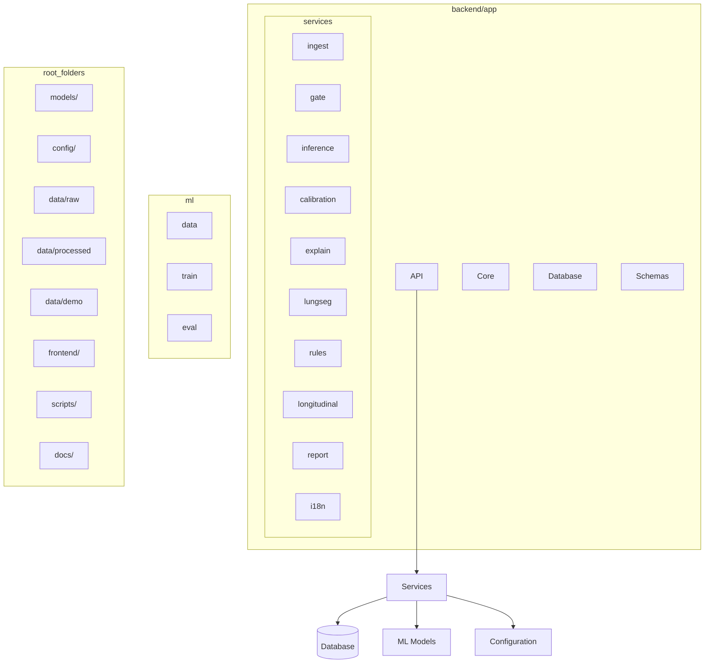

# Architecture

This document describes the XRAY-ASSISTANT project architecture.

## Modules

## API Endpoints Planned

- `POST /auth/login`
- `POST /studies` (upload)
- `GET /studies/{id}`
- `GET /studies/{id}/result`
- `GET /studies/{id}/heatmap.png`
- `GET /studies/{id}/uncertainty.png`
- `POST /studies/{id}/compare/{other_id}`
- `GET /studies/{id}/report.pdf`
- `GET /health`
- `GET /models/status`
